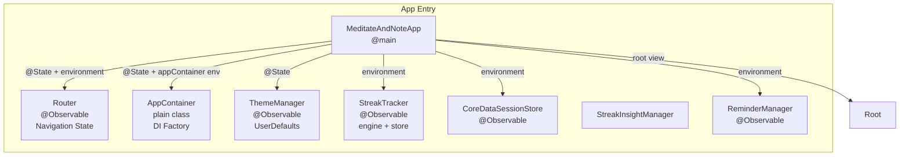
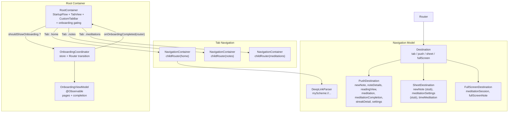
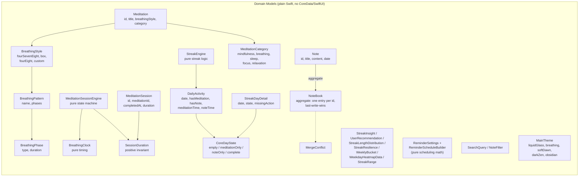
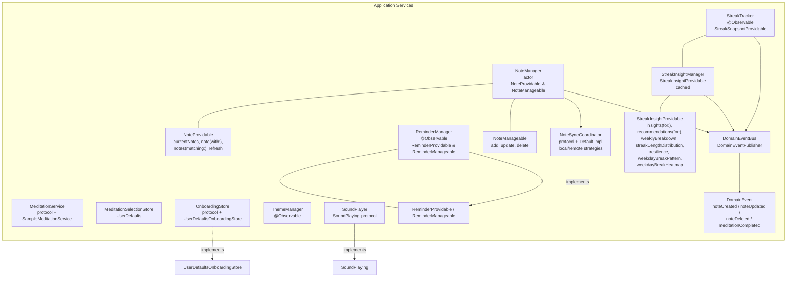
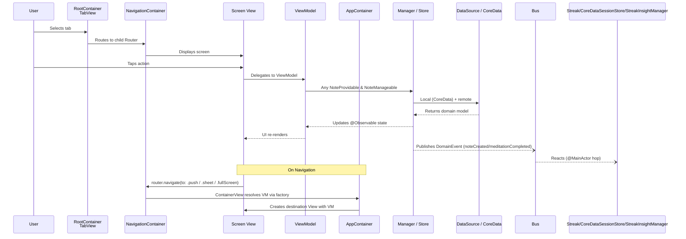
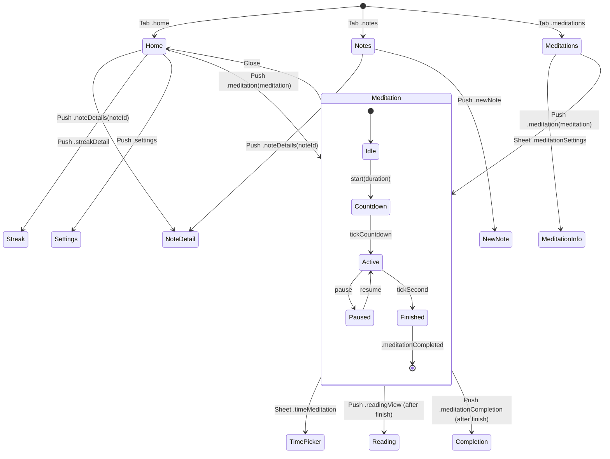

# MeditateAndNote — Architecture

Domain-Driven Design (DDD) app. SwiftUI + CoreData + `@Observable`, custom
Router-based navigation, per-domain `DataSource`/`Store` protocols, Managers
split into read/write (`<X>Providable` / `<X>Manageable`) boundaries, and
async / actor-backed persistence (Swift Concurrency safe).

Dependencies point inward toward the domain:

```
Presentation (SwiftUI Views, ViewModels)
        ↓
Application (NoteManager, StreakTracker, StreakInsightManager,
            ReminderManager, MeditationSessionEngine adapters, ...)
        ↓
Domain (Entities, Value Objects, DataSource/Store protocols)
        ↑
Infrastructure (Persistence/ — CoreData + UserDefaults implementations)
```

The Domain layer never imports `CoreData`/`SwiftUI`/`UIKit`. NSManagedObject
maps to domain models only inside the concrete DataSource/Store.

> **Swift Concurrency view.** Persistence paths are concurrency-safe:
> `NoteManager` and `InMemoryNoteDataSource` are actors, CoreData data sources
> use `context.perform`/`await`, view models that touch observable state are
> `@MainActor`, and the single `DomainEventBus` is a lock-based
> `DomainEventPublisher` with a synchronous `nonisolated` `publish` that runs
> on the emitter's thread. Subscribers hop onto `@MainActor` before mutating
> observable/CoreData state.

## App Entry & Dependency Injection



`AppContainer` is the DI root. It owns the singletons (DomainEventBus, data
sources, sync coordinator, managers) and exposes `make<X>ViewModel()` factory
methods; it never acts as a registration container. Mutation paths that leak
into `init` subscribe `StreakTracker`, `CoreDataSessionStore`, and
`StreakInsightManager` to `DomainEventBus`, each hopping to `@MainActor`.

Factored ViewModel constructors:

- `makeMainViewModel()` → `MainViewModel(meditationService, selectionStore)`
- `makeNoteEditorViewModel(noteId:)` → `NoteEditorViewModel(noteId, noteManager)`
- `makeMeditateSelectViewModel()` → `MeditateSelectViewModel(...)`
- `makeMeditationViewModel(for:)` → `MeditationViewModel(meditation, eventBus, soundPlayer)`
- `makeNoteMenuViewModel()` → the shared singleton `NoteMenuViewModel`
- `makeOnboardingViewModel(onCompletion:)` → `OnboardingViewModel(store, pages, onCompletion)`
- `makeInsightsViewModel()` → `InsightsViewModel(StreakInsightManager)`

## Root & Navigation



- `RootContainer` gates launch on `OnboardingCoordinator` (`shouldShowOnboarding`),
  showing onboarding before the tab bar mounts. A DEBUG `-showOnboarding`
  launch arg reopens it for dev.
- `Router` is a level-aware `@Observable` class holding `navigationStackPath`,
  `presentingSheet`, `presentingFullScreen`, `isDetailPresented`, and
  `selectedTab`. Children are created via `childRouter(for:)`; only the active
  router resolves deep links. It is injected via `@Environment(Router.self)` —
  views read it non-optionally (Observation tracks only what a body actually
  reads), and `NavigationContainer` owns its child router in `@State`, wrapping
  it in a local `@Bindable` for `NavigationStack`/sheet bindings.
- `Destination` wraps `PushDestination`/`SheetDestination`/`FullScreenDestination`.
  Since the last update `.settings`, `.meditationCompletion` pushes and the
  `.meditationSession` full screen were added; `newNote`/`meditationSettings`
  sheet cases are currently mapped to `EmptyView()` stubs.
- `NavigationContainer` wraps each tab in a `NavigationStack` bound to its
  router, and maps destinations to concrete views via
  `Destination-ViewMapping.swift` + `ContainerView`.
- `NavigationContainer` exposes only the router and a view builder; it never
  holds screen logic. ViewModels never reference a concrete View.

## Views & ViewModels

```mermaid
graph TB
    subgraph Views["Views"]
        MainView["MainView<br/>Home Tab"]
        NoteMenu["NoteMenu<br/>Notes Tab"]
        MeditateSelect["MeditateSelectView<br/>Meditations Tab"]
        NoteEditor["NoteEditorView<br/>Note Editor"]
        MeditationView["MeditationView<br/>Active Session"]
        MeditationCompletion["MeditationCompletionView"]
        ReadingView["ReadingView<br/>Post-Meditation"]
        StreakDetail["StreakDetailView<br/>InsightsSection, WeekdayHeatmap,
<br/>LifetimePatternsSection, StreakDayDetailSheet"]
        SettingsView["SettingsView<br/>Reminder / Animation / Theme / Sound"]
        OnboardingView["OnboardingView<br/>OnboardingPageView"]
        TimeSheet["TimeMeditationSheet"]
        MeditationInfo["MeditationInfoScroll"]
    end

    subgraph ViewModels["ViewModels"]
        MainVM["MainViewModel<br/>@Observable"]
        NoteMenuVM["NoteMenuViewModel<br/>@Observable<br/>singleton"]
        NoteEditorVM["NoteEditorViewModel<br/>@Observable<br/>EditTarget state machine"]
        MeditateSelectVM["MeditateSelectViewModel<br/>@Observable<br/>loadState"]
        MeditationVM["MeditationViewModel<br/>@MainActor @Observable<br/>wraps MeditationSessionEngine"]
        InsightsVM["InsightsViewModel<br/>@Observable<br/>range + lifetime"]
        OnboardingVM["OnboardingViewModel<br/>@MainActor @Observable"]
    end

    MainView --> MainVM
    NoteMenu --> NoteMenuVM
    NoteEditor --> NoteEditorVM
    MeditateSelect --> MeditateSelectVM
    MeditationView --> MeditationVM
    StreakDetail --> InsightsVM
    OnboardingView --> OnboardingVM

    MainVM -->|uses| MeditSvc["MeditationService"]
    MainVM -->|uses| SelStore["MeditationSelectionStore"]
    MeditateSelectVM -->|uses| MeditSvc
    MeditateSelectVM -->|uses| SelStore
    NoteMenuVM -->|uses any NoteProvidable & NoteManageable| NM["NoteManager"]
    NoteEditorVM -->|uses any NoteProvidable & NoteManageable| NM
    InsightsVM -->|uses any StreakInsightProvidable| IM["StreakInsightManager"]
```



Note: `NoteMenuViewModel` is a singleton in `AppContainer` (loaded once,
keeps its event-bus subscription alive). `NoteEditorViewModel`,
`MeditationViewModel`, `OnboardingViewModel`, and `InsightsViewModel` are
created per screen via `make<X>ViewModel()`.

## Domain Model



Domain invariants live in the Value Objects / aggregate / engines:
- `NoteTitle` trims and supplies `"Untitled"`; `NoteContent` is a wrapper.
- `NoteBook` owns collection invariants (one row per `NoteID`, LWW by date).
- `SessionDuration` rejects non-positive values even on the constructor path,
  and `SessionDuration` decoder path throws rather than allowing bad data.
- `DailyActivity` exposes a first-class `CoreDayState`
  (`empty / meditationOnly / noteOnly / complete`); `.complete` is the only
  streak-contributing state. `markMeditation`/`markNote` set the boolean and
  its timestamp atomically.
- `ReminderSettings` clamps `hour`/`minute` and guarantees a non-empty,
  valid weekday set; `ReminderScheduleBuilder` computes fire dates with pure
  calendar math (no `UNUserNotificationCenter`).
- `MeditationSessionEngine` is a deterministic state machine
  (`idle → countdown → active → finished`). `active` carries a wall-clock
  `anchoredAt` and a `finishing` flag — remaining time is derived from real
  elapsed time (timer drift / backgrounding can't overrun), and the session
  closes on an exhale phase boundary rather than mid-inhale. All side effects
  come back as `Event`s instead of being fired inline.
- `StreakEngine` holds the pure streak rules; `StreakTracker` is an `@Observable`
  adapter over it and forwards to `StreakActivityStore`. `StreakInsightEngine`
  (pure) + `StreakInsightManager` (cached) derive range-aware insights and
  lifetime patterns (distribution, resilience, break heatmap) from a
  `StreakSnapshot`.

## Application / Services Layer



`Services/` is grouped by domain folder rather than flat: `Notes/`
(`NoteManager`, `NotesRepository`, `NoteSyncCoordinator`), `Meditation/`
(`MeditationService`), `Events/` (`DomainEvents`), `Reminders/`
(`ReminderManager`, `NotificationScheduling`), `Settings/`
(`AnimationSettings`), `Onboarding/` (`OnboardingStore`), `Theme/`
(`ThemeManager`), plus `Sound/` (`SoundPlayer`, `SoundSettings`) and `Streak/`
(`StreakTracker`, `StreakInsightEngine`, `StreakInsightManager`).

- **`NoteManager`** (actor) is the application service for notes. It exposes
  two protocols: `NoteProvidable` (read) and `NoteManageable` (write), plus a
  typed `NoteOperationError` (`.loadFailed` / `.saveFailed` / `.deleteFailed`).
  It holds its own `NoteBook` aggregate (rebuilt from the sync coordinator
  after each mutation) and publishes domain events. ViewModels depend on
  `any NoteProvidable & NoteManageable`.
- **`NoteSyncCoordinator`** (`DefaultNoteSyncCoordinator`) orchestrates
  local/remote reads and writes by `SyncStrategy` (`localOnly`, `remoteOnly`,
  `localFirst`, `remoteFirst`, `hybrid`). Hybrid merges via
  `NoteBook.merged` and reports `MergeConflict`s; remote writes are best-effort
  (`bestEffort`) so local data is safe even if remote sync fails.
- **`StreakTracker`** is an `@Observable` adapter over the pure `StreakEngine`
  (`StreakSnapshotProvidable` read boundary). **`StreakInsightManager`** depends
  on `any StreakSnapshotProvidable` (not the concrete tracker) and exposes
  `StreakInsightProvidable` — range-aware insights/recommendations plus
  lifetime patterns, with per-(range, signature) memoization invalidated by
  domain events.
- **`ReminderManager`** (ReminderProvidable / ReminderManageable) orchestrates
  `ReminderSettings` with a `NotificationScheduling` abstraction; every
  mutation persists and reschedules a 7-day notification horizon.
- **Domain events** decouple bounded contexts: `DomainEvent` is a closed sum
  type; subscribers (`StreakTracker`, `CoreDataSessionStore`,
  `StreakInsightManager`, `NoteMenuViewModel`) switch exhaustively, so adding a
  case is a compile-time decision. The bus publishes on the emitter's thread;
  subscribers hop to `@MainActor` before mutating observable/CoreData state.

## Infrastructure (Persistence)

```mermaid
graph TB
    subgraph SQLite["CoreData (programmatic model, no .xcdatamodeld)"]
        CDM["CoreDataManager<br/>NSPersistentContainer<br/>buildModel(), newBackgroundContext()"]
        CDNote["CoreDataNoteDataSource<br/>conforms NoteDataSource"]
        CDStreak["CoreDataStreakStore<br/>conforms StreakActivityStore"]
        CDSession["CoreDataSessionStore<br/>concrete store (accepted exception)<br/>@Observable"]

        CDEvent["CDNote / CDMeditationSession /<br/>CDDailyActivity / CDStreakMeta<br/>NSManagedObject entities"]
    end

    subgraph Contracts["Persistence Protocols (Domain)"]
        ND["NoteDataSource<br/>fetchAll / fetch(id:) / save /<br/>delete(id:) / deleteAll"]
        SA["StreakActivityStore<br/>load / save snapshot"]
        RS["ReminderSettingsStore<br/>load / save ReminderSettings"]
        NS["NotificationScheduling<br/>isAuthorized / requestAuthorization /<br/>scheduleNotification / removeAllPending"]
        OS["OnboardingStore<br/>hasCompletedOnboarding /<br/>markOnboardingCompleted"]
        IM["InMemoryNoteDataSource<br/>actor · conforms NoteDataSource<br/>(tests & previews)"]
        UDS["UserDefaultsStreakStore<br/>conforms StreakActivityStore<br/>+ legacy migration"]
        UDReminder["UserDefaultsReminderSettingsStore<br/>conforms ReminderSettingsStore"]
        SysSched["SystemNotificationScheduler<br/>conforms NotificationScheduling<br/>(UNUserNotificationCenter)"]
        UDOnb["UserDefaultsOnboardingStore<br/>conforms OnboardingStore"]
    end

    CDNote -.-> ND
    IM -.-> ND
    CDStreak -.-> SA
    UDS -.-> SA
    UDReminder -.-> RS
    SysSched -.-> NS
    UDOnb -.-> OS
    CDNote --> CDM
    CDStreak --> CDM
    CDSession --> CDM
    CDNote --> CDEvent
    CDStreak --> CDEvent
    CDSession --> CDEvent
```



- `CoreDataManager` owns the `NSPersistentContainer` and builds the model
  programmatically (CDNote, CDMeditationSession, CDDailyActivity, CDStreakMeta).
  Only DataSources/Stores touch it. If the disk store fails to load it falls
  back to an in-memory store so the app stays usable.
- All NSManagedObject → domain mapping stays inside the concrete
  DataSource/Store (`.toNote()`, `.apply()`, `.findOrCreate()`).
- `CoreDataSessionStore` is a known accepted exception — a concrete `@Observable`
  type with no protocol abstraction (unlike `CoreDataStreakStore`, which
  conforms to `StreakActivityStore`).
- Async / actor persistence: CoreData data sources route I/O through
  `context.perform` / `await context.perform`; `InMemoryNoteDataSource` is an
  actor. These live in `Persistence/` plus `Services/` (streak/reminder store
  protocols and their UserDefaults impls keep the Domain free of framework
  imports).

## Data Flow



## Navigation State Machine



`MeditationViewModel` drives the `MeditationSessionEngine` timer loop; on
`.completed` it builds a `MeditationSession` and publishes
`.meditationCompleted` on the `DomainEventBus`, which `CoreDataSessionStore`
persists, `StreakTracker` feeds into the streak engine, and
`StreakInsightManager` uses to invalidate its cache. The schedule no longer
requires an on-screen `ReadingView` — a `MeditationCompletionView` push is
available via `.meditationCompletion(meditation:duration:)`.
