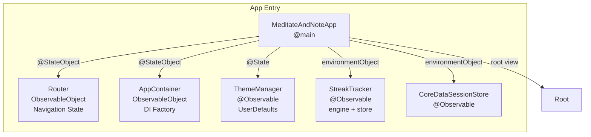
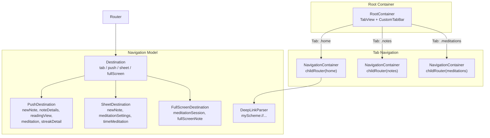
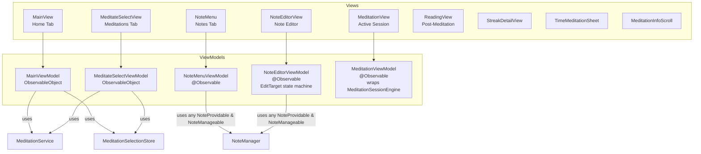
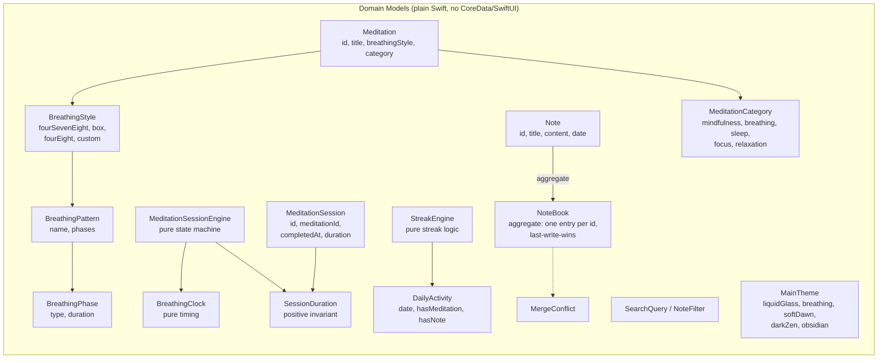
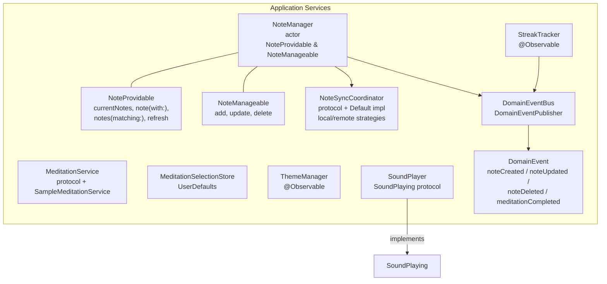
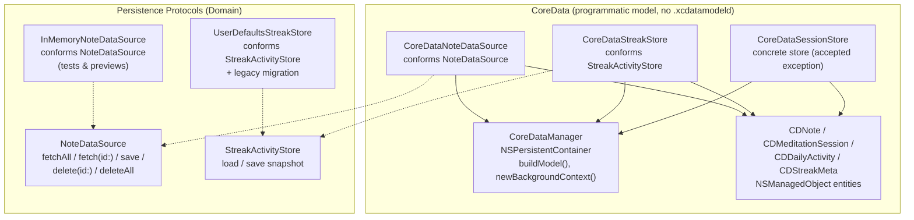
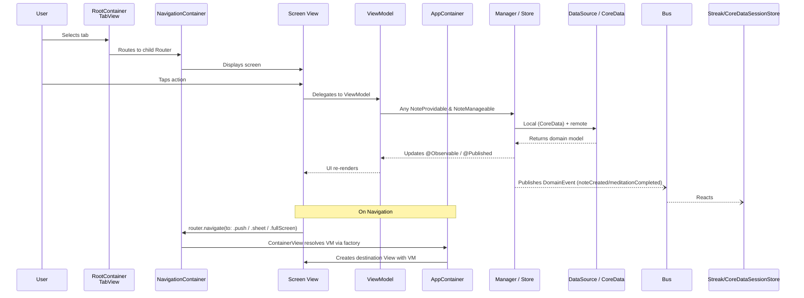
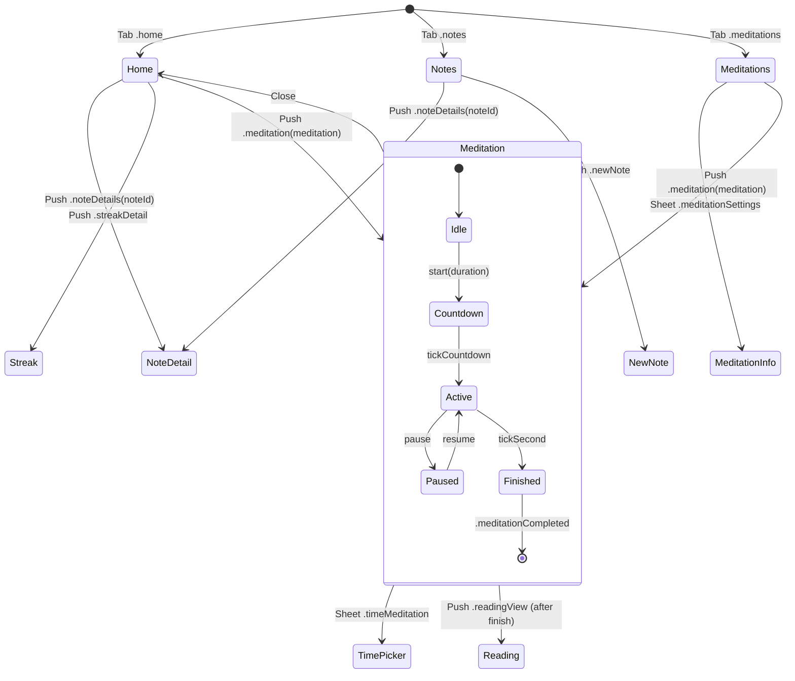

# MeditateAndNote — Architecture

Domain-Driven Design (DDD) app. SwiftUI + CoreData + `@Observable`, custom
Router-based navigation, per-domain `DataSource`/`Store` protocols, and a
`NoteManager` split into `NoteProvidable` / `NoteManageable`.

Dependencies point inward toward the domain:

```
Presentation (SwiftUI Views, ViewModels)
        ↓
Application (NoteManager, StreakTracker, MeditationSessionEngine adapters, ...)
        ↓
Domain (Entities, Value Objects, DataSource/Store protocols)
        ↑
Infrastructure (Persistence/ — CoreData implementations)
```

The Domain layer never imports `CoreData`/`SwiftUI`/`UIKit`. NSManagedObject
maps to domain models only inside the concrete DataSource/Store.

## App Entry & Dependency Injection



`AppContainer` is the DI root. It owns the singletons (event bus, data
sources, sync coordinator, managers) and exposes `make<X>ViewModel()` factory
methods; it never acts as a registration container.

## Root & Navigation



- `Router` is a level-aware `ObservableObject` holding `navigationStackPath`,
  `presentingSheet`, `presentingFullScreen`, and `selectedTab`. Children are
  created via `childRouter(for:)`; only the active router resolves deep links.
- `NavigationContainer` wraps each tab in a `NavigationStack` bound to its
  router, and maps `PushDestination`/`SheetDestination`/`FullScreenDestination`
  to concrete views via `Destination-ViewMapping.swift` + `ContainerView`.
- `NavigationContainer` exposes only the router and a view builder; it never
  holds screen logic. ViewModels never reference a concrete View.

## Views & ViewModels



Note: `NoteMenuViewModel` is a singleton in `AppContainer` (loaded once,
keeps its event-bus subscription alive). `NoteEditorViewModel` and
`MeditationViewModel` are created per screen via `make<X>ViewModel()`.

## Domain Model



Domain invariants live in the Value Objects / aggregate / engines:
- `NoteTitle` trims and supplies `"Untitled"`; `NoteContent` is a wrapper.
- `NoteBook` owns collection invariants (one row per `NoteID`, LWW by date).
- `SessionDuration` rejects non-positive values even on the constructor path.
- `MeditationSessionEngine` is a deterministic state machine
  (`idle → countdown → active → finished`); all side effects come back as
  `Event`s instead of being fired inline.
- `StreakEngine` holds the pure streak rules; `StreakTracker` is an `@Observable`
  adapter over it and forwards to `StreakActivityStore`.

## Application / Services Layer



- **`NoteManager`** (actor) is the application service for notes. It exposes
  two protocols: `NoteProvidable` (read) and `NoteManageable` (write), plus a
  typed `NoteOperationError` (`.loadFailed` / `.saveFailed` / `.deleteFailed`).
  It holds its own `NoteBook` aggregate and publishes domain events after each
  mutation. ViewModels depend on `any NoteProvidable & NoteManageable`.
- **`NoteSyncCoordinator`** (`DefaultNoteSyncCoordinator`) orchestrates
  local/remote reads and writes by `SyncStrategy` (`localOnly`, `remoteOnly`,
  `localFirst`, `remoteFirst`, `hybrid`). Hybrid merges via
  `NoteBook.merged` and reports `MergeConflict`s.
- **Domain events** decouple bounded contexts: `DomainEvent` is a closed sum
  type; subscribers (`StreakTracker`, `CoreDataSessionStore`,
  `NoteMenuViewModel`) switch exhaustively, so adding a case is a compile-time
  decision.

## Infrastructure (Persistence)



- `CoreDataManager` owns the `NSPersistentContainer` and builds the model
  programmatically (CDNote, CDMeditationSession, CDDailyActivity, CDStreakMeta).
  Only DataSources/Stores touch it.
- All NSManagedObject → domain mapping stays inside the concrete
  DataSource/Store (`.toNote()`, `.apply()`, `.findOrCreate()`).
- `CoreDataSessionStore` is a known accepted exception — a concrete `@Observable`
  type with no protocol abstraction (unlike `CoreDataStreakStore`, which
  conforms to `StreakActivityStore`).

## Data Flow



## Navigation State Machine



`MeditationViewModel` drives the `MeditationSessionEngine` timer loop; on
`.completed` it builds a `MeditationSession` and publishes
`.meditationCompleted` on the `DomainEventBus`, which `CoreDataSessionStore`
persists and `StreakTracker` feeds into the streak engine.
