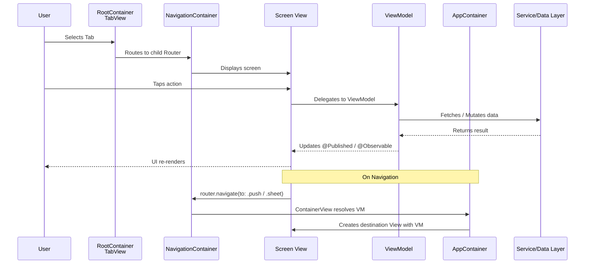
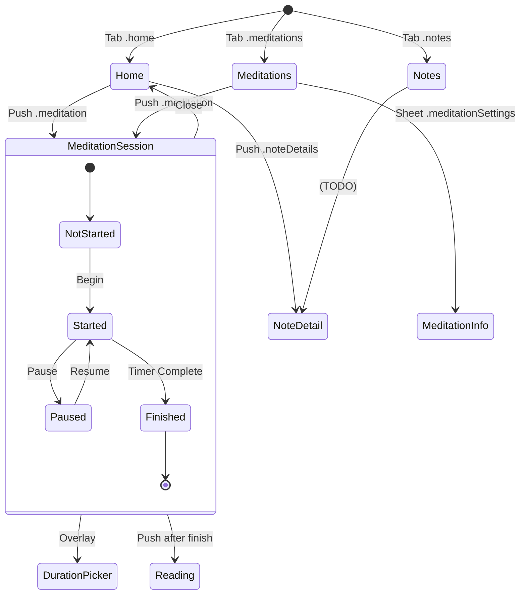

# MeditateAndNote — Architecture

```mermaid
graph TB
    subgraph Entry["App Entry"]
        App["MeditateAndNoteApp<br/>@main"]
        Router["Router<br/>ObservableObject<br/>Navigation State"]
        Container["AppContainer<br/>ObservableObject<br/>DI Factory"]
        Theme["ThemeManager<br/>@Observable<br/>UserDefaults"]
    end

    App -->|"@StateObject"| Router
    App -->|"@StateObject"| Container
    App -->|"@Environment"| Theme
    App -->|"root view"| Root

    subgraph Root["Root Container"]
        RootView["RootContainer<br/>TabView + CustomTabBar"]
    end

    RootView -->|"Tab: .home"| NavHome
    RootView -->|"Tab: .notes"| NavNotes
    RootView -->|"Tab: .meditations"| NavMeditations

    subgraph Tabs["Tab Navigation"]
        NavHome["NavigationContainer<br/>childRouter(home)"]
        NavNotes["NavigationContainer<br/>childRouter(notes)"]
        NavMeditations["NavigationContainer<br/>childRouter(meditations)"]
    end

    NavHome --> MainView
    NavNotes --> NoteMenuView
    NavMeditations --> MeditateSelectView

    subgraph Views["Views"]
        MainView["MainView<br/>Home Tab"]
        NoteMenuView["NoteMenu<br/>Notes Tab"]
        MeditateSelectView["MeditateSelectView<br/>Meditations Tab"]
        NoteDetailView["NoteView<br/>Note Editor"]
        MeditationView["MeditationView<br/>Active Session"]
        ReadingView["ReadingView<br/>Post-Meditation"]
        TimeSheet["TimeMeditationSheet<br/>Duration Picker"]
        MeditationInfo["MeditationInfoScroll<br/>Meditation Details"]
        ThemePicker["ThemePickerView"]
    end

    subgraph Navigation["Navigation Flows"]
        MainView -->|"Push .meditation"| MeditationView
        MainView -->|"Push .noteDetails"| NoteDetailView
        MeditateSelectView -->|"Sheet .meditationSettings"| MeditationInfo
        MeditateSelectView -->|"Push .meditation"| MeditationView
        MeditationView -->|"Overlay"| TimeSheet
        MeditationView -->|"Push after finish"| ReadingView
    end

    subgraph ViewModels["ViewModels"]
        MainVM["MainViewModel"]
        NoteMenuVM["NoteMenuViewModel<br/>@Observable"]
        NoteVM["NoteViewModel"]
        MeditateSelectVM["MeditateSelectViewModel"]
        MeditationVM["MeditationViewModel<br/>State Machine"]
    end

    MainView -->|"@StateObject"| MainVM
    NoteMenuView -->|"@State"| NoteMenuVM
    NoteDetailView -->|"created by Container"| NoteVM
    MeditateSelectView -->|"@StateObject"| MeditateSelectVM
    MeditationView -->|"@StateObject"| MeditationVM

    Container -.->|"makeMainViewModel()"| MainVM
    Container -.->|"makeNoteMenuView()"| NoteMenuVM
    Container -.->|"makeNoteViewModel(id)"| NoteVM
    Container -.->|"makeMeditateSelectVM()"| MeditateSelectVM
    Container -.->|"makeMeditationVM(meditation)"| MeditationVM

    subgraph Models["Models"]
        Note["Note<br/>Codable, Identifiable<br/>id, title, content, date"]
        Meditation["Meditation<br/>Identifiable, Hashable<br/>id, title, breathingStyle, category"]
        BreathingStyle["BreathingStyle<br/>fourSevenEight, box,<br/>fourEight, custom"]
        BreathingPattern["BreathingPattern<br/>name, phases"]
        BreathingPhase["BreathingPhase<br/>type, duration"]
        MeditationCategory["MeditationCategory<br/>mindfulness, breathing,<br/>sleep, focus, relaxation"]
        MeditationState["MeditationState<br/>notStarted → started →<br/>paused → finished"]
        MeditationDuration["MeditationDuration<br/>1min, 3min, 5min"]
        MainThemeEnum["MainTheme<br/>liquidGlass, breathing,<br/>softDawn, darkZen"]
    end

    Meditation --> BreathingStyle
    BreathingStyle --> BreathingPattern
    BreathingPattern --> BreathingPhase
    Meditation --> MeditationCategory
    MeditationVM --> MeditationState
    MeditationVM --> MeditationDuration
    Theme --> MainThemeEnum

    subgraph Services["Services & Data Layer"]
        MeditationService["MeditationService<br/>Protocol"]
        SampleMeditationSvc["SampleMeditationService<br/>In-Memory Sample Data"]
        NotesRepo["Repository&lt;Note&gt;<br/>Strategy Pattern"]
        UserDefaultsDS["UserDefaultsNotesRepository<br/>Local Persistence"]
        InMemoryDS["InMemoryNotesDataSource<br/>Sample Data"]
        APIDS["APINotesRepository<br/>REST Stub"]
        NoteManagerActor["NoteManager<br/>actor<br/>Thread-Safe CRUD"]
        AnyItemMgr["AnyItemManager&lt;Note&gt;<br/>Type-Erased Wrapper"]
    end

    MeditationService -.->|"conforms"| SampleMeditationSvc
    MainVM -->|"uses"| MeditationService
    MeditateSelectVM -->|"uses"| MeditationService
    NotesRepo --> UserDefaultsDS
    NotesRepo --> InMemoryDS
    NotesRepo --> APIDS
    NoteManagerActor -->|"wraps"| NotesRepo
    AnyItemMgr -->|"type-erases"| NoteManagerActor
    NoteMenuVM -->|"uses"| AnyItemMgr
    MainVM -->|"uses"| NotesRepo
    NoteVM -->|"uses"| NotesRepo

    subgraph Search["Search & UI State"]
        SearchBar["SearchBar<br/>Reusable Component"]
        SearchStateObj["SearchState<br/>@Observable"]
        NotesUIStateObj["NotesUIState<br/>@Observable"]
        ScrollDetector["ScrollDetector<br/>UIViewRepresentable"]
    end

    NoteMenuView --> SearchBar
    NoteMenuView --> SearchStateObj
    NoteMenuView --> NotesUIStateObj
    NoteMenuView --> ScrollDetector
    NoteMenuVM --> SearchStateObj

    subgraph Components["Shared Components"]
        NoteCard["NoteCard<br/>iOS 26 Glass Effect"]
        NoteCardsView["NoteCardsView<br/>Stacked Card Deck"]
        MeditateBtnComp["MeditateButtonComponents<br/>Theme-Aware Styles"]
        ConcentricRing["ConcentricRing<br/>Animated Visualization"]
        ProgressView["MeditationProgressView<br/>Progress Bar"]
    end

    MainView --> NoteCardsView
    NoteCardsView --> NoteCard
    MainView --> MeditateBtnComp
    MeditationView --> ConcentricRing
    MeditationView --> ProgressView

    subgraph Protocols["Key Protocols"]
        ItemProvidable["ItemProvidable<br/>currentItems, filterItems"]
        ItemManagable["ItemManagable<br/>addItem, deleteItem, clearAll"]
        DataSourceProto["DataSourceProtocol<br/>fetchAll, fetch, save, delete"]
    end

    NoteManagerActor -.-> ItemProvidable
    NoteManagerActor -.-> ItemManagable
    AnyItemMgr -.-> ItemProvidable
    AnyItemMgr -.-> ItemManagable
    UserDefaultsDS -.-> DataSourceProto
    InMemoryDS -.-> DataSourceProto

    classDef entry fill:#1a1a2e,stroke:#e94560,color:#fff
    classDef view fill:#16213e,stroke:#0f3460,color:#fff
    classDef vm fill:#0f3460,stroke:#533483,color:#fff
    classDef model fill:#533483,stroke:#e94560,color:#fff
    classDef service fill:#1a1a2e,stroke:#0f3460,color:#fff
    classDef component fill:#16213e,stroke:#533483,color:#fff
    classDef protocol fill:#0f3460,stroke:#e94560,color:#fff,stroke-dasharray:5 5

    class App,Router,Container,Theme entry
    class RootView,NavHome,NavNotes,NavMeditations,MainView,NoteMenuView,MeditateSelectView,NoteDetailView,MeditationView,ReadingView,TimeSheet,MeditationInfo,ThemePicker view
    class MainVM,NoteMenuVM,NoteVM,MeditateSelectVM,MeditationVM vm
    class Note,Meditation,BreathingStyle,BreathingPattern,BreathingPhase,MeditationCategory,MeditationState,MeditationDuration,MainThemeEnum model
    class MeditationService,SampleMeditationSvc,NotesRepo,UserDefaultsDS,InMemoryDS,APIDS,NoteManagerActor,AnyItemMgr service
    class NoteCard,NoteCardsView,MeditateBtnComp,ConcentricRing,ProgressView,SearchBar,SearchStateObj,NotesUIStateObj,ScrollDetector component
    class ItemProvidable,ItemManagable,DataSourceProto protocol
```

## Data Flow

```mermaid
sequenceDiagram
    participant User
    participant Tab as RootContainer<br/>TabView
    participant Nav as NavigationContainer
    participant View as Screen View
    participant VM as ViewModel
    participant Container as AppContainer
    participant Service as Service/Data Layer

    User->>Tab: Selects Tab
    Tab->>Nav: Routes to child Router
    Nav->>View: Displays screen

    User->>View: Taps action
    View->>VM: Delegates to ViewModel
    VM->>Service: Fetches / Mutates data
    Service-->>VM: Returns result
    VM-->>View: Updates @Published / @Observable
    View-->>User: UI re-renders

    Note over View,Container: On Navigation
    View->>Nav: router.navigate(to: .push / .sheet)
    Nav->>Container: ContainerView resolves VM
    Container->>View: Creates destination View with VM
```

## Navigation State Machine

```mermaid
stateDiagram-v2
    [*] --> Home: Tab .home
    [*] --> Notes: Tab .notes
    [*] --> Meditations: Tab .meditations

    Home --> MeditationSession: Push .meditation
    Home --> NoteDetail: Push .noteDetails

    Meditations --> MeditationInfo: Sheet .meditationSettings
    Meditations --> MeditationSession: Push .meditation

    MeditationSession --> DurationPicker: Overlay
    MeditationSession --> Reading: Push after finish
    MeditationSession --> Home: Close

    Notes --> NoteDetail: (TODO)

    state MeditationSession {
        [*] --> NotStarted
        NotStarted --> Started: Begin
        Started --> Paused: Pause
        Paused --> Started: Resume
        Started --> Finished: Timer Complete
        Finished --> [*]
    }
```
